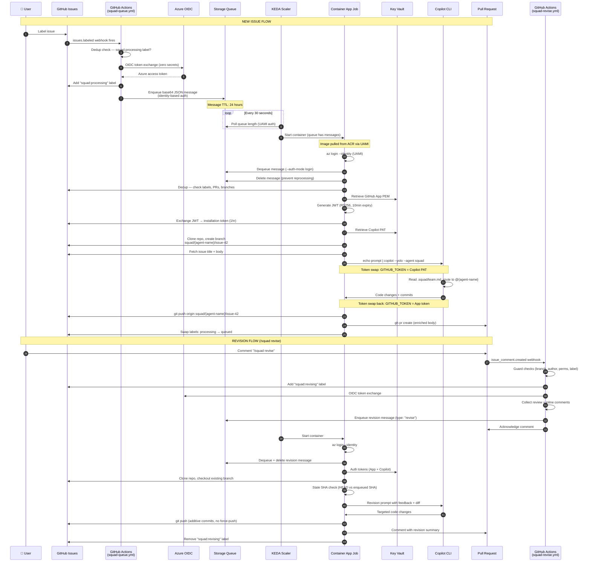
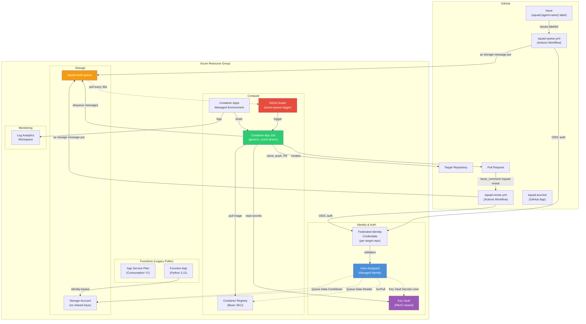

# Architecture

> Deep technical architecture of the Squad on ACA platform — how every piece fits together.

---

## End-to-End Flow

The following sequence diagram traces a complete lifecycle from issue labeling through PR creation and the `/squad revise` feedback loop.



---

## Component Diagram

All Azure resources and their relationships:



---

## Entrypoint Decision Tree

The `agents/base/entrypoint.sh` script orchestrates the entire agent lifecycle. This flowchart maps every decision point:

```mermaid
flowchart TD
    Start([Container Starts]) --> EnvCheck{Required env vars<br/>all set?}
    EnvCheck -->|No| DieMissing[/"FATAL: [VAR] is not set"/]
    EnvCheck -->|Yes| AzLogin["az login --identity<br/>--client-id AZURE_CLIENT_ID"]
    AzLogin --> Dequeue["az storage message get<br/>(--auth-mode login)"]
    Dequeue --> QueueEmpty{Queue empty<br/>or null?}
    QueueEmpty -->|Yes| CleanExit([Exit 0 — clean])
    QueueEmpty -->|No| ParseMsg["Parse message ID,<br/>popReceipt, content"]
    ParseMsg --> Decode["Base64 decode<br/>message content"]
    Decode --> ExtractFields["Extract: type, issue_number,<br/>agent_type, repo,<br/>pr_number, branch, head_sha"]
    ExtractFields --> DeleteMsg["Delete message from queue<br/>(prevent reprocessing)"]
    DeleteMsg --> AppAuth["Retrieve PEM from Key Vault"]
    AppAuth --> GenJWT["Generate JWT<br/>(RS256, 10min expiry)"]
    GenJWT --> InstToken["Exchange JWT →<br/>installation access token (1hr)"]
    InstToken --> CopilotPAT["Retrieve Copilot PAT<br/>from Key Vault"]
    CopilotPAT --> GhAuth["gh auth setup-git"]
    GhAuth --> EnsureLabels["Ensure pipeline labels exist<br/>(auto-creates squad:processing<br/>and squad:queued only)"]
    EnsureLabels --> MsgTypeCheck{MSG_TYPE?}

    MsgTypeCheck -->|"revise"| ReviseFlow
    MsgTypeCheck -->|"new" / default| NewFlow

    subgraph ReviseFlow["Revision Flow"]
        direction TB
        R1["Clone repo + checkout<br/>existing branch"] --> R2{HEAD SHA<br/>matches enqueued?}
        R2 -->|No| R2a["Comment stale warning<br/>Remove squad:revising<br/>Exit 0"]
        R2 -->|Yes| R3["Collect review feedback<br/>(reviews + inline comments + diff)"]
        R3 --> R4["Build revision prompt"]
        R4 --> R5["Swap token → Copilot PAT"]
        R5 --> R6["echo prompt | copilot --yolo --agent squad"]
        R6 --> R7["Swap token → App token"]
        R7 --> R8["Stage + commit changes"]
        R8 --> R9["Commit .squad/ state"]
        R9 --> R10["git push (additive, no force)"]
        R10 --> R11["Comment revision summary on PR"]
        R11 --> R12["Remove squad:revising label"]
    end

    subgraph NewFlow["New Issue Flow"]
        direction TB
        N1{squad:queued<br/>label exists?} -->|Yes| N1a["Already handled → Exit 0"]
        N1 -->|No| N2{squad:processing<br/>label exists?}
        N2 -->|No| N2a["Missing label → Exit 0"]
        N2 -->|Yes| N3{Existing open PR<br/>for this issue?}
        N3 -->|Yes| N3a["Swap labels → Exit 0"]
        N3 -->|No| N4{Existing branch<br/>for this issue?}
        N4 -->|Yes| N4a["Branch exists → Exit 0"]
        N4 -->|No| N5["Clone repo + create branch<br/>squad/{agent}/issue-{N}"]
        N5 --> N6["Fetch issue title + body"]
        N6 --> N7["Swap token → Copilot PAT"]
        N7 --> N8["echo prompt | copilot --yolo --agent squad"]
        N8 --> N9["Swap token → App token"]
        N9 --> N10{Copilot<br/>produced commits?}
        N10 -->|Yes| N11["Stage uncommitted changes"]
        N10 -->|No| N12["Create work artifact<br/>.squad-work/issue-N.md"]
        N11 --> N13["Commit .squad/ state"]
        N12 --> N13
        N13 --> N14["git push + gh pr create<br/>(enriched body)"]
        N14 --> N15["Swap labels:<br/>processing → queued"]
    end

    style DieMissing fill:#E74C3C,color:#fff
    style CleanExit fill:#27AE60,color:#fff
    style R2a fill:#F39C12,color:#fff
    style N1a fill:#95A5A6,color:#fff
    style N2a fill:#95A5A6,color:#fff
    style N3a fill:#95A5A6,color:#fff
    style N4a fill:#95A5A6,color:#fff
```



---

## Dual-Auth Pattern

GitHub Apps cannot hold Copilot licenses. This creates a fundamental authentication split:

| Token | Source | Purpose | Lifetime | Stored In |
|-------|--------|---------|----------|-----------|
| **App Installation Token** | GitHub App PEM → JWT → token exchange | git push, PR create, label ops, issue edits | 1 hour | Generated at runtime |
| **Copilot PAT** | Copilot-licensed user's Personal Access Token | `copilot --yolo` CLI invocation only | Until revoked/expired | Key Vault secret |

### How the token swap works in `entrypoint.sh`:

```bash
# App token generated from GitHub App installation
APP_TOKEN="${GITHUB_TOKEN}"

# Before Copilot CLI — swap to Copilot PAT
export GITHUB_TOKEN="${COPILOT_TOKEN}"
echo "${SQUAD_PROMPT}" | copilot --yolo --agent squad

# After Copilot CLI — swap back to App token
export GITHUB_TOKEN="${APP_TOKEN}"
git push origin "${BRANCH}"
gh pr create ...
```

### Why two tokens?

1. **GitHub Apps are org-level identities** — they don't have user accounts, so they can't be assigned Copilot licenses.
2. **Copilot CLI requires `GITHUB_TOKEN`** — it uses this env var to authenticate with GitHub's Copilot API. The token must belong to a user with an active Copilot license.
3. **Minimal blast radius** — the Copilot PAT only needs `copilot` scope. It's never used for git operations, PR creation, or label management.
4. **Audit clarity** — all repository mutations (commits, PRs, labels) show as `squad-aca-bot[bot]`, not a personal user.

---

## KEDA Scaling Model

KEDA (Kubernetes Event Driven Autoscaling) is built into Azure Container Apps and drives the entire scale-to-zero model.

### How it works

```
KEDA polls Storage Queue every 30 seconds
    ↓
Queue length > 0 → start container executions
    ↓
Queue length = 0 → scale to zero (no containers running)
```

### Configuration (from `infra/main.tf`)

| Setting | Value | Purpose |
|---------|-------|---------|
| `pollingInterval` | 30 seconds | How often KEDA checks the queue |
| `queueLength` | 1 | Messages per execution (1 container per message) |
| `minExecutions` | 0 | Scale to zero when queue is empty |
| `maxExecutions` | 10 (configurable) | Maximum parallel containers |
| `parallelism` | 1 | Each execution processes one message |
| `replicaCompletionCount` | 1 | Job completes after one replica finishes |

### Identity-based auth for KEDA

Standard KEDA azure-queue scalers use connection strings. This platform uses **identity-based auth** because:

1. Subscription policy enforces `allowSharedKeyAccess = false` on storage accounts.
2. Connection strings are secrets — identity-based auth eliminates secret rotation.
3. The `azapi_resource` is used instead of AVM because the `azurerm` provider doesn't support the `identity` field at the KEDA scale rule level.

```hcl
# KEDA scale rule with identity-based auth (azapi_resource)
rules = [{
  name = "queue-scaling"
  type = "azure-queue"
  metadata = {
    queueName   = var.queue_name
    queueLength = "1"
    accountName = local.storage_account_name
  }
  identity = azurerm_user_assigned_identity.squad_agent.id  # <-- key difference
}]
```

### Why the container self-dequeues

KEDA can auto-dequeue messages, but this platform uses **container-managed dequeue** for several reasons:

1. **Deduplication** — the container checks labels, existing PRs, and branches before doing work.
2. **Message deletion control** — the message is deleted immediately after parsing, not after processing. This prevents a failed container from reprocessing the same message.
3. **Graceful empty-queue handling** — KEDA may trigger a container after the queue has already been drained by a parallel container. The entrypoint detects empty queues and exits cleanly (`exit 0`).

---

## Message Flow Architecture

### Queue message schema (new issue)

```json
{
  "issue_number": 42,
  "agent_type": "{agent-name}",
  "repo": "owner/repo",
  "title": "Fix login redirect bug"
}
```

> **Note**: `agent_type` matches the agent name from your `.squad/team.md` (e.g., `ripley`, `data`). These names are assigned by Squad's casting system during team initialization.
```

### Queue message schema (revision)

```json
{
  "type": "revise",
  "pr_number": 100,
  "issue_number": 42,
  "branch": "squad/{agent-name}/issue-42",
  "agent_type": "{agent-name}",
  "repo": "owner/repo",
  "head_sha": "abc123...",
  "feedback": "{\"reviews\":{...},\"inline_comments\":[...]}"
}
```

### Encoding

All messages are **base64-encoded** before being placed on the Azure Storage Queue. The container decodes at runtime:

```bash
# Encoding (in GitHub Actions workflow)
MESSAGE_B64=$(echo "${MESSAGE}" | base64 -w 0)
az storage message put --content "${MESSAGE_B64}" ...

# Decoding (in entrypoint.sh)
QUEUE_MESSAGE=$(echo "${MSG_BODY_B64}" | base64 -d)
```

### TTL (Time to Live)

- **24 hours** (`--time-to-live 86400`) — messages expire if not processed within a day.
- This prevents stale messages from accumulating if the container infrastructure is down.
- If a message expires, the issue retains its `squad:processing` label, which can be manually removed to retry.

### Flow lifecycle

```
GitHub Actions → base64 encode → az storage message put → Queue
                                                            ↓
Container ← base64 decode ← az storage message get ← KEDA trigger
         ↓
         az storage message delete (immediate)
         ↓
         Process work (clone, copilot, PR)
```

---

## RBAC Role Assignments

All authentication is identity-based. Here is the complete RBAC map:

| Principal | Role | Scope | Purpose |
|-----------|------|-------|---------|
| UAMI (squad-agent) | Storage Queue Data Reader | Storage Account | KEDA polls queue length |
| UAMI (squad-agent) | Storage Queue Data Contributor | Storage Account | Container dequeues + deletes messages |
| UAMI (squad-agent) | AcrPull | Container Registry | Pull container image |
| UAMI (squad-agent) | AcrPush | Container Registry | Import base images from Docker Hub |
| UAMI (squad-agent) | Key Vault Secrets User | Key Vault | Read PEM + Copilot PAT at runtime |
| Function App (system MI) | Storage Blob Data Owner | Storage Account | Host runtime blob access |
| Function App (system MI) | Storage Queue Data Contributor | Storage Account | Write messages via queue output binding |
| Function App (system MI) | Storage Account Contributor | Storage Account | Host runtime management |
| Deployer (current user) | Key Vault Secrets Officer | Key Vault | Upload PEM + PAT via `az keyvault secret set` |
| GitHub Actions (OIDC) | *(via UAMI federated cred)* | — | Workflow authenticates as UAMI to enqueue messages |

---

## Container Image Architecture

The Docker image uses a two-stage build for minimal runtime size:

```
┌─────────────────────────────────────────────┐
│ Stage 1: Build (golang:1.23.4-bookworm)     │
│  ├── Go toolchain                           │
│  ├── GitHub CLI (gh)                        │
│  ├── Node.js 22                             │
│  └── @github/copilot (npm global)           │
├─────────────────────────────────────────────┤
│ Stage 2: Runtime (debian:bookworm-slim)     │
│  ├── COPY Go toolchain from build           │
│  ├── COPY gh CLI from build                 │
│  ├── COPY @github/copilot from build        │
│  ├── git, curl, jq, openssl                 │
│  ├── python3 + azure-cli (pip)              │
│  ├── Node.js 22 (fresh install)             │
│  └── entrypoint.sh                          │
└─────────────────────────────────────────────┘
```

Base images are cached in ACR to avoid Docker Hub rate limits:

```bash
az acr import --name <acr> --source docker.io/library/golang:1.23.4-bookworm \
  --image base/golang:1.23.4-bookworm
az acr import --name <acr> --source docker.io/library/debian:bookworm-20240701-slim \
  --image base/debian:bookworm-20240701-slim
```
