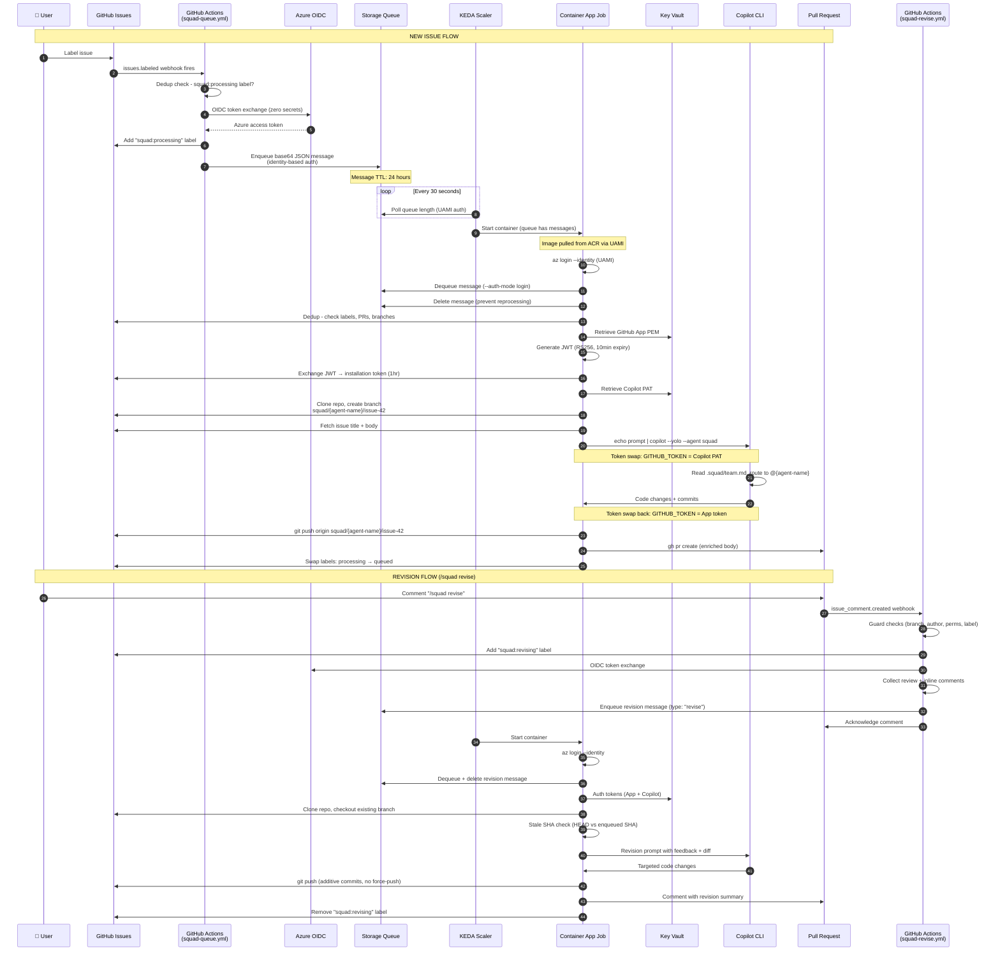
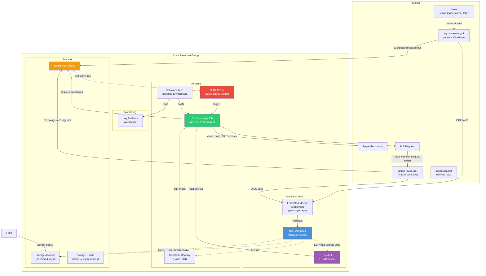

# Architecture

> Deep technical architecture of the Squad on ACA platform - how every piece fits together.

---

## Infrastructure-as-code paths

Squad on ACA now includes two deployment paths that produce equivalent Azure resources:

- `infra/terraform/` - the canonical and default Terraform path.
- `infra/bicep/` - the Azure-native Bicep path used by `azd`.

See [Terraform vs Bicep and azd: which should you choose?](adoption-guide.md#terraform-vs-bicep-and-azd-which-should-you-choose) for the tradeoffs.

---

## End-to-End Flow

The following sequence diagram traces a complete lifecycle from issue labeling through PR creation and the `/squad revise` feedback loop.


```mermaid
sequenceDiagram
    autonumber
    participant User as 👤 User
    participant GH as GitHub Issues
    participant WF as GitHub Actions<br/>(squad-queue.yml)
    participant AZ as Azure OIDC
    participant Q as Storage Queue
    participant KEDA as KEDA Scaler
    participant Job as Container App Job
    participant KV as Key Vault
    participant Copilot as Copilot CLI
    participant PR as Pull Request
    participant RevWF as GitHub Actions<br/>(squad-revise.yml)

    Note over User,PR: NEW ISSUE FLOW

    User->>GH: Label issue #42 with "squad:{agent-name}"
    GH->>WF: issues.labeled webhook fires
    WF->>WF: Dedup check - squad:processing label?
    WF->>AZ: OIDC token exchange (zero secrets)
    AZ-->>WF: Azure access token
    WF->>GH: Add "squad:processing" label
    WF->>Q: Enqueue base64 JSON message<br/>(identity-based auth)
    Note over Q: Message TTL: 24 hours

    loop Every 30 seconds
        KEDA->>Q: Poll queue length (UAMI auth)
    end

    KEDA->>Job: Start container (queue has messages)
    Note over Job: Image pulled from ACR via UAMI

    Job->>Job: az login --identity (UAMI)
    Job->>Q: Dequeue message (--auth-mode login)
    Job->>Q: Delete message (prevent reprocessing)
    Job->>GH: Dedup - check labels, PRs, branches
    Job->>KV: Retrieve GitHub App PEM
    Job->>Job: Generate JWT (RS256, 10min expiry)
    Job->>GH: Exchange JWT → installation token (1hr)
    Job->>KV: Retrieve Copilot PAT
    Job->>GH: Clone repo, create branch<br/>squad/{agent-name}/issue-42
    Job->>GH: Fetch issue title + body
    Job->>Copilot: echo prompt | copilot --yolo --agent squad
    Note over Job,Copilot: Token swap: GITHUB_TOKEN = Copilot PAT
    Copilot->>Copilot: Read .squad/team.md, route to @{agent-name}
    Copilot->>Job: Code changes + commits
    Note over Job,Copilot: Token swap back: GITHUB_TOKEN = App token
    Job->>GH: git push origin squad/{agent-name}/issue-42
    Job->>PR: gh pr create (enriched body)
    Job->>GH: Swap labels: processing → queued

    Note over User,PR: REVISION FLOW (/squad revise)

    User->>PR: Comment "/squad revise"
    PR->>RevWF: issue_comment.created webhook
    RevWF->>RevWF: Guard checks (branch, author, perms, label)
    RevWF->>GH: Add "squad:revising" label
    RevWF->>AZ: OIDC token exchange
    RevWF->>RevWF: Collect review + inline comments
    RevWF->>Q: Enqueue revision message (type: "revise")
    RevWF->>PR: Acknowledge comment

    KEDA->>Job: Start container
    Job->>Job: az login --identity
    Job->>Q: Dequeue + delete revision message
    Job->>KV: Auth tokens (App + Copilot)
    Job->>GH: Clone repo, checkout existing branch
    Job->>Job: Stale SHA check (HEAD vs enqueued SHA)
    Job->>Copilot: Revision prompt with feedback + diff
    Copilot->>Job: Targeted code changes
    Job->>GH: git push (additive commits, no force-push)
    Job->>PR: Comment with revision summary
    Job->>GH: Remove "squad:revising" label
```

---

## Component Diagram

All Azure resources and their relationships:


```mermaid
graph TB
    subgraph GitHub["GitHub"]
        Issue["Issue<br/>(squad:{agent-name} label)"]
        WF_Queue["squad-queue.yml<br/>(Actions Workflow)"]
        WF_Revise["squad-revise.yml<br/>(Actions Workflow)"]
        App["squad-aca-bot<br/>(GitHub App)"]
        Repo["Target Repository"]
        PR["Pull Request"]
    end

    subgraph Azure["Azure Resource Group"]
        subgraph Identity["Identity & Auth"]
            UAMI["User-Assigned<br/>Managed Identity"]
            FedCred["Federated Identity<br/>Credentials<br/>(per target repo)"]
            KV["Key Vault<br/>(RBAC-based)"]
        end

        subgraph Compute["Compute"]
            CAE["Container Apps<br/>Managed Environment"]
            Job["Container App Job<br/>(generic, event-driven)"]
            KEDA["KEDA Scaler<br/>(azure-queue trigger)"]
            ACR["Container Registry<br/>(Basic SKU)"]
        end

        subgraph Storage["Storage"]
            SA["Storage Account<br/>(no shared keys)"]
            Queue["squad-work-queue"]
        end

        subgraph Monitoring["Monitoring"]
            LAW["Log Analytics<br/>Workspace"]
        end

        subgraph Storage["Storage & Queues"]
            SQ["Storage Queue<br/>(issue → agent routing)"]
        end
    end

    Issue -->|"issues.labeled"| WF_Queue
    PR -->|"issue_comment /squad revise"| WF_Revise
    WF_Queue -->|"OIDC auth"| FedCred
    WF_Revise -->|"OIDC auth"| FedCred
    FedCred -->|"validates"| UAMI
    WF_Queue -->|"az storage message put"| Queue
    WF_Revise -->|"az storage message put"| Queue
    Queue -.->|"poll every 30s"| KEDA
    KEDA -->|"trigger"| Job
    Job -->|"pull image"| ACR
    Job -->|"read secrets"| KV
    Job -->|"dequeue messages"| Queue
    Job -->|"clone, push, PR"| Repo
    Job -->|"creates"| PR
    UAMI -.->|"Queue Data Reader"| SA
    UAMI -.->|"Queue Data Contributor"| SA
    UAMI -.->|"AcrPull"| ACR
    UAMI -.->|"Key Vault Secrets User"| KV
    CAE -->|"hosts"| Job
    CAE -->|"logs"| LAW
    Func -->|"identity-based"| SA

    style UAMI fill:#4A90D9,color:#fff
    style Job fill:#2ECC71,color:#fff
    style Queue fill:#F39C12,color:#fff
    style KV fill:#9B59B6,color:#fff
    style KEDA fill:#E74C3C,color:#fff
```

---

## Entrypoint Decision Tree

The `agents/base/entrypoint.sh` script is the container entrypoint and thin
orchestrator. It sources focused runtime modules from `agents/base/lib/` plus
provider dispatch modules from `agents/base/providers/`. Messages without
provider metadata always resolve to `aca-job` for legacy queue compatibility;
environment variables do not reroute legacy messages. Selecting `aca-sandbox`
currently fails loudly before queue acknowledgement because sandbox provisioning
is not implemented yet. This flowchart maps every runtime decision point for the
existing ACA Job provider:


```mermaid
flowchart TD
    Start([Container Starts]) --> EnvCheck{Required env vars<br/>all set?}
    EnvCheck -->|No| DieMissing[/"FATAL: [VAR] is not set"/]
    EnvCheck -->|Yes| AzLogin["az login --identity<br/>--client-id AZURE_CLIENT_ID"]
    AzLogin --> Dequeue["az storage message get<br/>(--auth-mode login)"]
    Dequeue --> QueueEmpty{Queue empty<br/>or null?}
    QueueEmpty -->|Yes| CleanExit([Exit 0 - clean])
    QueueEmpty -->|No| ParseMsg["Parse message ID,<br/>popReceipt, content"]
    ParseMsg --> Decode["Base64 decode<br/>message content"]
    Decode --> ExtractFields["Extract: type, issue_number,<br/>agent_type, repo,<br/>provider, pr_number, branch, head_sha"]
    ExtractFields --> ProviderCheck{Provider?}
    ProviderCheck -->|"aca-sandbox / unsupported"| SandboxStub[/"FATAL before ack<br/>message remains queued"/]
    ProviderCheck -->|"aca-job / absent"| DeleteMsg["Delete message from queue<br/>(prevent reprocessing)"]
    DeleteMsg --> AppAuth["Retrieve PEM from Key Vault"]
    AppAuth --> GenJWT["Generate JWT<br/>(RS256, 10min expiry)"]
    GenJWT --> InstToken["Exchange JWT →<br/>installation access token (1hr)"]
    InstToken --> CopilotPAT["Retrieve Copilot PAT<br/>from Key Vault"]
    CopilotPAT --> GhAuth["gh auth setup-git"]
    GhAuth --> EnsureLabels["Ensure pipeline labels exist<br/>(auto-creates squad:processing<br/>and squad:queued - NOT agent labels)"]
    EnsureLabels --> MsgTypeCheck{MSG_TYPE?}

    MsgTypeCheck -->|"revise"| ReviseFlow
    MsgTypeCheck -->|"new" / default| NewFlow

    subgraph ReviseFlow["Revision Flow"]
        direction TB
        R1["Clone repo + checkout<br/>existing branch"] --> R2{HEAD SHA<br/>matches enqueued?}
        R2 -->|No| R2a["Comment stale warning<br/>Remove squad:revising<br/>Exit 0"]
        R2 -->|Yes| R3["Collect review feedback<br/>(reviews + inline comments + diff)"]
        R3 --> R4["Build revision prompt"]
        R4 --> R5["Swap token → Copilot PAT"]
        R5 --> R6["echo prompt | copilot --yolo --agent squad"]
        R6 --> R7["Swap token → App token"]
        R7 --> R8["Stage + commit changes"]
        R8 --> R9["Commit .squad/ state"]
        R9 --> R10["git push (additive, no force)"]
        R10 --> R11["Comment revision summary on PR"]
        R11 --> R12["Remove squad:revising label"]
    end

    subgraph NewFlow["New Issue Flow"]
        direction TB
        N1{squad:queued<br/>label exists?} -->|Yes| N1a["Already handled → Exit 0"]
        N1 -->|No| N2{squad:processing<br/>label exists?}
        N2 -->|No| N2a["Missing label → Exit 0"]
        N2 -->|Yes| N3{Existing open PR<br/>for this issue?}
        N3 -->|Yes| N3a["Swap labels → Exit 0"]
        N3 -->|No| N4{Existing branch<br/>for this issue?}
        N4 -->|Yes| N4a["Branch exists → Exit 0"]
        N4 -->|No| N5["Clone repo + create branch<br/>squad/{agent}/issue-{N}"]
        N5 --> N6["Fetch issue title + body"]
        N6 --> N7["Swap token → Copilot PAT"]
        N7 --> N8["echo prompt | copilot --yolo --agent squad"]
        N8 --> N9["Swap token → App token"]
        N9 --> N10{Copilot<br/>produced commits?}
        N10 -->|Yes| N11["Stage uncommitted changes"]
        N10 -->|No| N12["Create work artifact<br/>.squad-work/issue-N.md"]
        N11 --> N13["Commit .squad/ state"]
        N12 --> N13
        N13 --> N14["git push + gh pr create<br/>(enriched body)"]
        N14 --> N15["Swap labels:<br/>processing → queued"]
    end

    style DieMissing fill:#E74C3C,color:#fff
    style CleanExit fill:#27AE60,color:#fff
    style R2a fill:#F39C12,color:#fff
    style N1a fill:#95A5A6,color:#fff
    style N2a fill:#95A5A6,color:#fff
    style N3a fill:#95A5A6,color:#fff
    style N4a fill:#95A5A6,color:#fff
```

---

## Dual-Auth Pattern

GitHub Apps cannot hold Copilot licenses. This creates a fundamental authentication split:

| Token | Source | Purpose | Lifetime | Stored In |
|-------|--------|---------|----------|-----------|
| **App Installation Token** | GitHub App PEM → JWT → token exchange | git push, PR create, label ops, issue edits | 1 hour | Generated at runtime |
| **Copilot PAT** | Copilot-licensed user's Personal Access Token | `copilot --yolo` CLI invocation only | Until revoked/expired | Key Vault secret |

### How the token swap works in `entrypoint.sh`:

```bash
# App token generated from GitHub App installation
APP_TOKEN="${GITHUB_TOKEN}"

# Before Copilot CLI - swap to Copilot PAT
export GITHUB_TOKEN="${COPILOT_TOKEN}"
echo "${SQUAD_PROMPT}" | copilot --yolo --agent squad

# After Copilot CLI - swap back to App token
export GITHUB_TOKEN="${APP_TOKEN}"
git push origin "${BRANCH}"
gh pr create ...
```

### Why two tokens?

1. **GitHub Apps are org-level identities** - they don't have user accounts, so they can't be assigned Copilot licenses.
2. **Copilot CLI requires `GITHUB_TOKEN`** - it uses this env var to authenticate with GitHub's Copilot API. The token must belong to a user with an active Copilot license.
3. **Minimal blast radius** - the Copilot PAT only needs `copilot` scope. It's never used for git operations, PR creation, or label management.
4. **Audit clarity** - all repository mutations (commits, PRs, labels) show as `squad-aca-bot[bot]`, not a personal user.

---

## KEDA Scaling Model

KEDA (Kubernetes Event Driven Autoscaling) is built into Azure Container Apps and drives the entire scale-to-zero model.

### How it works

```
KEDA polls Storage Queue every 30 seconds
    ↓
Queue length > 0 → start container executions
    ↓
Queue length = 0 → scale to zero (no containers running)
```

### Configuration (from `infra/terraform/main.tf`)

The Bicep path in `infra/bicep/` uses equivalent Container App Job settings.

| Setting | Value | Purpose |
|---------|-------|---------|
| `pollingInterval` | 30 seconds | How often KEDA checks the queue |
| `queueLength` | 1 | Messages per execution (1 container per message) |
| `minExecutions` | 0 | Scale to zero when queue is empty |
| `maxExecutions` | 10 (configurable) | Maximum parallel containers |
| `parallelism` | 1 | Each execution processes one message |
| `replicaCompletionCount` | 1 | Job completes after one replica finishes |

### Identity-based auth for KEDA

Standard KEDA azure-queue scalers use connection strings. This platform uses **identity-based auth** because:

1. Subscription policy enforces `allowSharedKeyAccess = false` on storage accounts.
2. Connection strings are secrets - identity-based auth eliminates secret rotation.
3. The `azapi_resource` is used instead of AVM because the `azurerm` provider doesn't support the `identity` field at the KEDA scale rule level.

```hcl
# KEDA scale rule with identity-based auth (azapi_resource)
rules = [{
  name = "queue-scaling"
  type = "azure-queue"
  metadata = {
    queueName   = var.queue_name
    queueLength = "1"
    accountName = local.storage_account_name
  }
  identity = azurerm_user_assigned_identity.squad_agent.id  # <-- key difference
}]
```

### Why the container self-dequeues

KEDA can auto-dequeue messages, but this platform uses **container-managed dequeue** for several reasons:

1. **Deduplication** - the container checks labels, existing PRs, and branches before doing work.
2. **Message deletion control** - the message is deleted immediately after parsing, not after processing. This prevents a failed container from reprocessing the same message.
3. **Graceful empty-queue handling** - KEDA may trigger a container after the queue has already been drained by a parallel container. The entrypoint detects empty queues and exits cleanly (`exit 0`).

---

## Message Flow Architecture

### ACA Sandbox contract boundary

PR 1 adds versioned, machine-validatable contracts under
`contracts/aca-sandbox/v1/`. The contracts describe coordinator execution
plans, persona dispatch and results, artifact manifests, integration results,
provider identity, and the existing queue message with optional extensions.
They establish data boundaries only. The current ACA Job entrypoint and queue
runtime continue to use their existing behavior.

The lifecycle is:

```text
Squad initialization
  -> dynamic roster snapshot (logical member ID, resolved name, charter, capabilities, revision/hash)
  -> coordinator plan (baseline SHA, owned tasks, dependencies, provider)
  -> persona dispatch/result
  -> artifact manifest
  -> integration result
```

Roster values are resolved from the initialized Squad state at execution time.
No dynamic contract encodes a cast name, fixed role, or team size. A baseline
SHA and roster revision/hash travel with fan-out work so every future worker
can prove which source and roster snapshot it used. Providers are an opaque boundary:
contracts identify the provider and its contract version, while provisioning
and worker execution remain outside this PR.

PR 3 adds the first optional infrastructure for that future provider. Terraform
creates an ACA Sandbox Group only when `enable_aca_sandbox = true`. The Sandbox
Group is a regional `Microsoft.App/sandboxGroups@2026-07-01` resource created
through `azapi_resource` because the AzureRM provider has no native resource for
it. The default flag value is `false`, so existing ACA Job deployments remain
unchanged.

The sandbox dispatcher has its own user-assigned managed identity. That identity
receives exactly one RBAC grant: `Container Apps SandboxGroup Data Owner` scoped
to the Sandbox Group. Persona sandboxes get no managed identity and no inherited
access to Key Vault, ACR push, Storage Queue, or GitHub write tokens. The current
shared ACA Job identity remains in place for compatibility, and splitting it is
deferred to a later hardening PR.

Dispatcher outputs include the Sandbox Group ID, Sandbox Group name, dispatcher
client ID, dispatcher principal ID, and the per-sandbox defaults for CPU
(`1000m`), memory (`2048Mi`), and auto-suspend (`300` seconds). These defaults
are runtime sandbox create parameters, not Sandbox Group properties. ACR
authentication for Sandbox Groups is still unverified and is tracked as a PR 5
follow-up.

PR 4 adds the persona sandbox worker image under `agents/sandbox/`. The image is
separate from the legacy ACA Job runtime. It includes Git, Node.js, jq, and the
Copilot CLI, but it intentionally omits Azure CLI login flows, Key Vault access,
Storage Queue tooling, GitHub CLI publication tooling, and GitHub App JWT
helpers. The trusted dispatcher is expected to create the sandbox, pre-stage a
repository working copy at the dispatch `baseline_sha`, deliver runner
environment through a stdin bootstrap payload, and collect output artifacts.

The in-sandbox runner clones only the pre-staged repository path supplied by the
dispatcher and removes the clone remote before running Copilot. It fails closed
if the cloned HEAD differs from the dispatch baseline. Dispatch envelopes include
`owned_paths`, interpreted as exact file paths or directory prefixes. After
Copilot exits, the runner unsets credential environment variables, writes a
binary git patch for audit, and rejects any patch that changes paths outside
`owned_paths` or touches protected control-plane paths. The protected paths are
`.squad/**` and `.github/workflows/**`.

PR 5 adds the trusted dispatcher under `dispatcher/`. It is dependency-free
Node.js and uses the same contract validator as PR 1. The CLI defaults to the
offline fake client:

```text
node dispatcher/cli.js --plan plan.json --repo <path> --out <dir> --client fake
```

The live ACA client is opt-in and refuses to run unless
`SQUAD_ENABLE_ACA_SANDBOX=1` is set. This prevents accidental live sandbox
creation during local tests or CI dry runs.

For each plan task, the dispatcher builds a schema-valid `persona.dispatch`
envelope from the plan's roster snapshot, creates one sandbox with labels for
execution ID, task ID, and logical member ID, and stages source by uploading a
local git bundle for the baseline commit. The sandbox clones from that bundle
and detaches to the baseline SHA. No repository remote URL, GitHub App token, or
write credential enters the persona sandbox.

Task dependencies are enforced before dispatch. Independent tasks run in
parallel up to a small configurable concurrency limit. If a dependency fails,
the dependent task is marked `skipped` and no sandbox is created for it. The
default policy is fail closed: any persona task failure makes the dispatcher
execution fail.

The dispatcher starts a fixed `exec-with-env.js` bootstrap inside the sandbox
and writes one JSON object of runner environment variables to stdin. The
bootstrap validates the keys against an allowlist, sets them, and execs the
persona runner. This keeps `SQUAD_SOURCE_REPO_PATH`, `SQUAD_OUTPUT_DIR`, and
`SQUAD_COPILOT_TOKEN` out of local `aca` process environment and out of
`aca sandbox exec` argv. It rejects classic `ghp_` tokens because the Sandbox
path requires fine-grained `github_pat_` credentials. The token is not written
to the dispatch envelope, git bundle, argv, logs, or summary. Runner stdout,
stderr, and downloaded artifacts are scanned for the exact token and common
GitHub token prefixes before the task can succeed.

Inside the runner, the Copilot token is handed to `copilot-launch.sh` on file
descriptor 3. The launcher reads the token, closes the descriptor, exports
`GITHUB_TOKEN`, and execs Copilot. The minimal environment passed through
`runuser`, `setpriv`, and `env -i` contains only non-secret values, so the token
does not appear in parent process argv.

Artifact collection is dispatcher-owned. After the runner exits, the dispatcher
downloads `persona-result.json`, `artifact-manifest.json`, and every listed
artifact. It revalidates result and manifest contracts, recomputes every
artifact sha256, rescans downloaded content for credentials, and rechecks patch
paths against `owned_paths` plus protected path rules with
`contracts/aca-sandbox/v1/tools/path-scope.js`. Sandbox delete runs in a
`finally` block. Delete failures are recorded in `dispatcher-summary.json`
without hiding the original task error.

The sandbox image now creates a separate `copilot-agent` user. In the container,
the runner keeps staging and output directories private and drops privileges for
the Copilot process with `runuser` or `setpriv`. Local tests that cannot switch
users run in an explicit `same-user` mode and assert the marker in
`logs/isolation-mode.txt`, so the weaker local path is visible.

The only live ACA assumptions are isolated in
`dispatcher/clients/aca-cli-client.js` and marked UNVERIFIED: exact `aca`
create and exec flags, JSON output shape, file transfer support, delete
behavior, stdin forwarding for bootstrap environment delivery, and ACR
authentication from Sandbox Groups. If stdin forwarding is not available, the
planned fallback is an env JSON file uploaded to a runner-only tmpfs path with
mode `600`, read once by the same bootstrap, and deleted immediately. That
fallback is also UNVERIFIED and is not the default. PR 6 must verify these
against a real Sandbox Group before workflow wiring can enable the provider.

Squad built-ins such as Coordinator, Scribe, Ralph, Rai, and optional
`@copilot` are modeled as `function` or `system` roster membership. They are
not project persona assumptions. Project personas are resolved dynamically from
the initialized roster.

The legacy queue payload remains valid:

```json
{
  "issue_number": 42,
  "agent_type": "example-agent",
  "repo": "example-owner/example-repo",
  "title": "Illustrative legacy ACA Job task"
}
```

The queue contract has explicit legacy ACA Job, revision, and provider-extended
fan-out variants. The legacy variant remains exactly the emitted
`issue_number`, `agent_type`, `repo`, and `title` shape. Fan-out messages use a
structured provider object and dynamic member identity instead of treating
`agent_type` as a persona name. See `contracts/aca-sandbox/v1/README.md` and
its illustrative fixtures for the complete contract set.

### Queue message schema (new issue)

```json
{
  "issue_number": 42,
  "agent_type": "example-legacy-routing-key",
  "repo": "owner/repo",
  "title": "Fix login redirect bug"
}
```

> **Compatibility note**: `agent_type` is a legacy opaque routing value retained
> for the current ACA Job runtime. It is not the identity field for dynamic
> Sandbox work.

### Queue message schema (revision)

```json
{
  "type": "revise",
  "pr_number": 100,
  "issue_number": 42,
  "branch": "squad/example-legacy-routing-key/issue-42",
  "agent_type": "example-legacy-routing-key",
  "repo": "owner/repo",
  "head_sha": "abc123...",
  "feedback": "{\"reviews\":{...},\"inline_comments\":[...]}"
}
```

### Encoding

All messages are **base64-encoded** before being placed on the Azure Storage Queue. The container decodes at runtime:

```bash
# Encoding (in GitHub Actions workflow)
MESSAGE_B64=$(echo "${MESSAGE}" | base64 -w 0)
az storage message put --content "${MESSAGE_B64}" ...

# Decoding (in entrypoint.sh)
QUEUE_MESSAGE=$(echo "${MSG_BODY_B64}" | base64 -d)
```

### TTL (Time to Live)

- **24 hours** (`--time-to-live 86400`) - messages expire if not processed within a day.
- This prevents stale messages from accumulating if the container infrastructure is down.
- If a message expires, the issue retains its `squad:processing` label, which can be manually removed to retry.

### Flow lifecycle

```
GitHub Actions → base64 encode → az storage message put → Queue
                                                            ↓
Container ← base64 decode ← az storage message get ← KEDA trigger
         ↓
         az storage message delete (immediate)
         ↓
         Process work (clone, copilot, PR)
```

---

## RBAC Role Assignments

All authentication is identity-based. Here is the complete RBAC map:

| Principal | Role | Scope | Purpose |
|-----------|------|-------|---------|
| UAMI (squad-agent) | Storage Queue Data Reader | Storage Account | KEDA polls queue length |
| UAMI (squad-agent) | Storage Queue Data Contributor | Storage Account | Container dequeues + deletes messages |
| UAMI (squad-agent) | AcrPull | Container Registry | Pull container image |
| UAMI (squad-agent) | AcrPush | Container Registry | Import base images from Docker Hub |
| UAMI (squad-agent) | Key Vault Secrets User | Key Vault | Read PEM + Copilot PAT at runtime |
| Deployer (current user) | Key Vault Secrets Officer | Key Vault | Upload PEM + PAT via `az keyvault secret set` |
| GitHub Actions (OIDC) | *(via UAMI federated cred)* | - | Workflow authenticates as UAMI to enqueue messages |

---

## Container Image Architecture

The Docker image uses a two-stage build for minimal runtime size:

```
┌─────────────────────────────────────────────┐
│ Stage 1: Build (golang:1.23.4-bookworm)     │
│  ├── Go toolchain                           │
│  ├── GitHub CLI (gh)                        │
│  ├── Node.js 22                             │
│  └── @github/copilot (npm global)           │
├─────────────────────────────────────────────┤
│ Stage 2: Runtime (debian:bookworm-slim)     │
│  ├── COPY Go toolchain from build           │
│  ├── COPY gh CLI from build                 │
│  ├── COPY @github/copilot from build        │
│  ├── git, curl, jq, openssl                 │
│  ├── python3 + azure-cli (pip)              │
│  ├── Node.js 22 (fresh install)             │
│  └── /opt/squad-runtime/                    │
│     ├── entrypoint.sh                       │
│     ├── lib/*.sh runtime modules            │
│     └── providers/*.sh provider dispatch    │
└─────────────────────────────────────────────┘
```

Base images are cached in ACR to avoid Docker Hub rate limits:

```bash
az acr import --name <acr> --source docker.io/library/golang:1.23.4-bookworm \
  --image base/golang:1.23.4-bookworm
az acr import --name <acr> --source docker.io/library/debian:bookworm-20240701-slim \
  --image base/debian:bookworm-20240701-slim
```

When you build manually, pass `--build-arg BASE_ACR_HOST=<your-acr-login-server>/` so the parameterized Dockerfile `FROM` lines use your ACR instead of the default bootstrap ACR.
